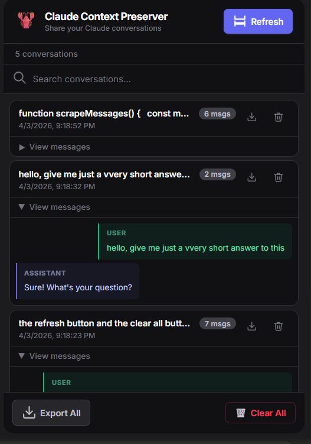
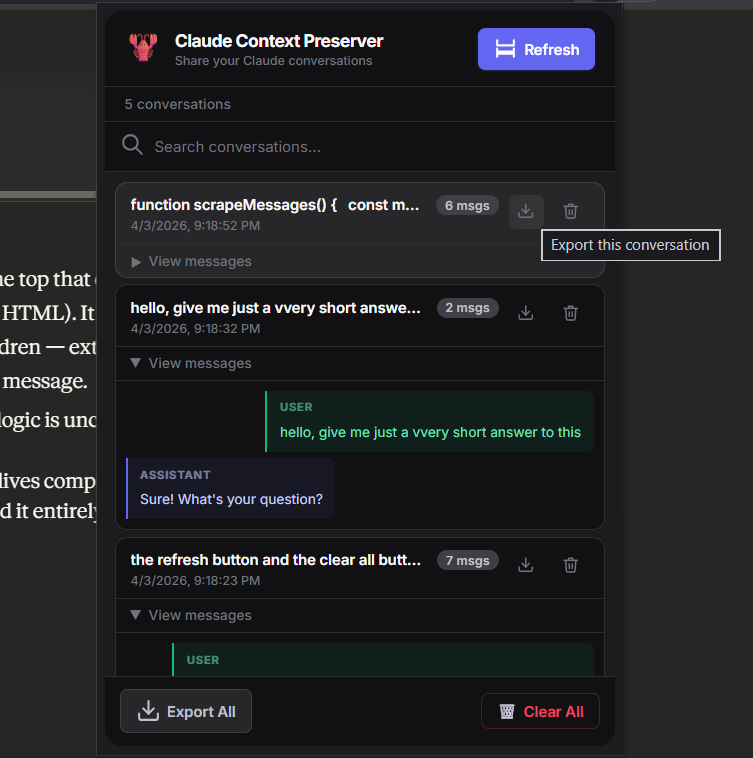
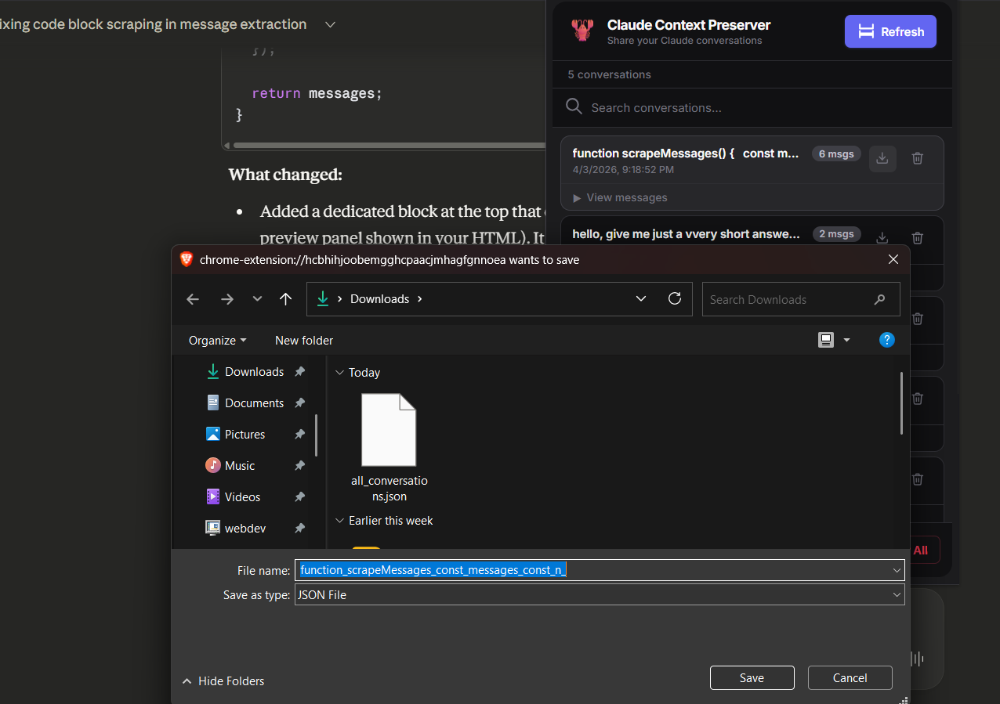

# 🦞 Claude Context Preserver


> **Never lose a Claude conversation again.** Save, compress, and port your AI context across sessions, accounts, and even different AI models.

```
   ██████╗ ██████╗ ███╗   ██╗████████╗███████╗██╗  ██╗████████╗
  ██╔════╝██╔═══██╗████╗  ██║╚══██╔══╝██╔════╝╚██╗██╔╝╚══██╔══╝
  ██║     ██║   ██║██╔██╗ ██║   ██║   █████╗   ╚███╔╝    ██║   
  ██║     ██║   ██║██║╚██╗██║   ██║   ██╔══╝   ██╔██╗    ██║   
  ╚██████╗╚██████╔╝██║ ╚████║   ██║   ███████╗██╔╝ ██╗   ██║   
   ╚═════╝ ╚═════╝ ╚═╝  ╚═══╝   ╚═╝   ╚══════╝╚═╝  ╚═╝   ╚═╝  
   
  ██████╗ ██████╗ ███████╗███████╗███████╗██████╗ ██╗   ██╗███████╗██████╗ 
  ██╔══██╗██╔══██╗██╔════╝██╔════╝██╔════╝██╔══██╗██║   ██║██╔════╝██╔══██╗
  ██████╔╝██████╔╝█████╗  ███████╗█████╗  ██████╔╝██║   ██║█████╗  ██████╔╝
  ██╔═══╝ ██╔══██╗██╔══╝  ╚════██║██╔══╝  ██╔══██╗╚██╗ ██╔╝██╔══╝  ██╔══██╗
  ██║     ██║  ██║███████╗███████║███████╗██║  ██║ ╚████╔╝ ███████╗██║  ██║
  ╚═╝     ╚═╝  ╚═╝╚══════╝╚══════╝╚══════╝╚═╝  ╚═╝  ╚═══╝  ╚══════╝╚═╝  ╚═╝
```

---

## 📋 Table of Contents

1. [The Problem](#-the-problem)
2. [The Solution](#-the-solution)
3. [Features](#-features)
4. [Preview](#-preview)
5. [Architecture](#-architecture)
6. [Installation](#-installation)
7. [How to Use](#-how-to-use)
8. [Setting Up Gemini API for Compression](#-setting-up-gemini-api-for-compression)
9. [Exporting & Porting Context to Other AIs](#-exporting--porting-context-to-other-ais)
10. [Compression Pipeline](#-compression-pipeline)
11. [File Structure](#-file-structure)
12. [Roadmap](#-roadmap)
13. [Contributing](#-contributing)
14. [License](#-license)

---

## 😤 The Problem

You've spent **2 hours** on a deep technical session with Claude. You've:

- Debugged a gnarly auth flow
- Designed a full database schema together
- Made 12 architectural decisions
- Written 400 lines of code collaboratively

Then — **BAM.** You hit your usage limit. Or your account gets switched. Or you want to continue on ChatGPT or Gemini because Claude is down.

**Everything is gone.** The context, the decisions, the nuance. You have to start from scratch and re-explain everything to a fresh Claude that has no idea what you've been building.

This is the problem Claude Context Preserver was built to solve.

---

## 💡 The Solution

```
┌──────────────────────────────────────────────────────────────────┐
│                                                                  │
│   Your Claude Chat  ──▶  🦞 Context Preserver  ──▶  📦 Capsule  │
│                                                                  │
│   Capsule  ──▶  New Claude Session  (or GPT / Gemini / Mistral) │
│                                                                  │
└──────────────────────────────────────────────────────────────────┘
```

**Claude Context Preserver** is a Chrome extension that:

1. **Silently watches** your Claude.ai conversations using a DOM observer
2. **Automatically saves** every message as you chat — no manual action needed
3. **Compresses** the conversation intelligently (optional, via Gemini API) to fit into tight context windows
4. **Exports** your saved context as a portable JSON capsule
5. **Lets you paste** that capsule into *any* AI — Claude, ChatGPT, Gemini, Mistral — and pick up right where you left off

No cloud servers. No sign-up. Everything runs locally in your browser.

---

## ✨ Features

| Feature | Status |
|---|---|
| 🔄 Auto-scrape conversations via MutationObserver | ✅ Live |
| 💾 Local storage (up to 50 conversations) | ✅ Live |
| 🔍 Search across saved conversations | ✅ Live |
| 📤 Export individual conversation as JSON | ✅ Live |
| 📦 Export ALL conversations as one JSON | ✅ Live |
| 🗑️ Delete individual conversations | ✅ Live |
| 🧠 AI-powered compression (Gemini 2.5 Flash) | ✅ Optional |
| 🔁 Port context to ChatGPT / Gemini / Mistral | ✅ Via JSON export |
| 🖥️ SPA navigation detection (no page reload needed) | ✅ Live |
| 📋 Rolling 10-session context window | 🔧 In Progress |
| 💉 One-click context injection button on claude.ai | 🗺️ Roadmap |
| 🧮 Local NLP compression (no API key) | 🗺️ Roadmap |
| 📥 View & manage downloads inside the extension | 🗺️ Roadmap |
| 🤖 One-click inject into ChatGPT / Gemini / Mistral | 🗺️ Roadmap |

---

## 🖼️ Preview

### Extension Popup


---

## 🏗️ Architecture

```
┌─────────────────────────────────────────────────────┐
│                  Chrome Extension                    │
│                                                     │
│  ┌─────────────┐    ┌──────────────┐    ┌────────┐  │
│  │Content      │    │Background    │    │Popup   │  │
│  │Script       │───▶│Service Worker│◀───│UI      │  │
│  │(scraper +   │    │(orchestrator)│    │(mgmt)  │  │
│  │ injector)   │    └──────┬───────┘    └────────┘  │
│  └─────────────┘           │                        │
│                            ▼                        │
│                   ┌────────────────┐                │
│                   │Compression     │                │
│                   │Pipeline        │                │
│                   │(Gemini 2.5)    │                │
│                   └───────┬────────┘                │
│                           │                         │
│              ┌────────────┴──────────┐              │
│              ▼                       ▼              │
│     chrome.storage.local         (IndexedDB         │
│     (index + 50 convs)            coming soon)      │
└─────────────────────────────────────────────────────┘
```

### How it works under the hood

**`content.js`** — Runs on every `claude.ai` page. Sets up a `MutationObserver` that watches the conversation DOM for changes. When a new message appears, it triggers a debounced save (1.5s delay to avoid saving mid-stream). It scrapes both user messages (`[data-testid="user-message"]`) and assistant responses (`.font-claude-response`), preserving code blocks in proper markdown format.

**`background.js`** — The service worker acting as an orchestrator. It holds the Gemini API key (so it never touches the content script) and handles compression requests. When `content.js` wants to compress a message, it sends a message to `background.js`, which calls Gemini 2.5 Flash and returns the compressed result.

**`popup.js` + `popup.html` + `popup.css`** — The extension popup UI. Lists all saved conversations, lets you search/filter, expand to view messages, delete individually, export to JSON, or clear everything.

---

## 🚀 Installation

Since this extension is not yet on the Chrome Web Store, you'll install it in **Developer Mode**:

### Step 1 — Download the extension files

Clone or download this repository:

```bash
git clone https://github.com/yourusername/claude-context-preserver.git
cd claude-context-preserver
```

### Step 2 — Open Chrome Extensions

Go to `chrome://extensions` in your browser.

### Step 3 — Enable Developer Mode

Toggle **Developer Mode** on (top right corner).

### Step 4 — Load the extension

Click **"Load unpacked"** and select the folder containing `manifest.json`.

### Step 5 — Verify installation

You should see the 🦞 lobster icon appear in your Chrome toolbar. If it's hidden, click the puzzle piece icon and pin it.

---

## 🛠️ How to Use

### Basic Usage (No API Key Required)

The extension works **out of the box** without any API key. It will save your raw conversations without AI compression.

#### 1. Open a Claude conversation

Navigate to [claude.ai](https://claude.ai) and start or open an existing conversation. The extension starts watching automatically.

#### 2. Chat normally

Just use Claude as you normally would. The extension silently captures every message in the background. You don't need to do anything.

#### 3. Click "Refresh" to save manually

If you want to force-save the current conversation immediately, click the 🦞 icon in your toolbar and hit the **Refresh** button.


#### 4. Browse your saved conversations

The popup shows all your saved conversations sorted by most recent. Each card shows:
- Conversation title (inferred from your first message)
- Date and time saved
- Message count
- Expand/collapse to read messages



#### 5. Search conversations

Use the search bar in the popup to find any conversation by title or message content.

#### 6. Delete conversations

Click the 🗑️ trash icon on any card to remove it. Or hit **Clear All** to wipe everything.

---

## 🔑 Setting Up Gemini API for Compression

> **Compression is optional.** The extension saves full, uncompressed conversations without it. But if you're hitting context-window limits when pasting into a new AI, compression helps significantly.

### Why Gemini for compression?

We use **Gemini 2.5 Flash** for its speed and generous free tier. The compression runs in the background service worker, meaning your API key never touches the content script or the page.

> **Note:** We're actively working on a purely local compression pipeline that requires zero API key. Stay tuned.

### Step 1 — Get a free Gemini API key

1. Go to [Google AI Studio](https://aistudio.google.com/app/apikey)
2. Sign in with your Google account
3. Click **"Create API Key"**
4. Copy the key

### Step 2 — Add the key to background.js

Open `background.js` in any text editor and find this line near the top:

```javascript
const GEMINI_API_KEY = ""; // keep as is for now
```

Replace it with your key:

```javascript
const GEMINI_API_KEY = "AIzaSy...yourkey..."; 
```

### Step 3 — Reload the extension

Go to `chrome://extensions` → find Claude Context Preserver → click the **refresh** (↺) icon.

### What compression does

When a Gemini API key is present, each message above 120 characters is sent to Gemini 2.5 Flash with this logic:

- **Code blocks** are extracted first and **never touched** — your code is always preserved 100%
- **User messages** are compressed to preserve intent (e.g., removes filler, keeps the actual question)
- **Assistant messages** are compressed technically and losslessly (keeps facts, removes verbose openers like "Certainly!")
- **Short messages** (< 120 chars) are skipped — not worth a network round-trip

> **Privacy note:** Message content is sent to Google's Gemini API during compression. If your conversations contain sensitive information, either disable compression (leave the key blank) or self-host a local model in the future.

---

## 📤 Exporting & Porting Context to Other AIs

This is the killer feature. **You are no longer locked into Claude.**

### Export a conversation

1. Open the extension popup
2. Find the conversation you want to export
3. Click the **download** (↓) icon on the card
4. A `.json` file downloads to your computer



### Export all conversations

Click **"Export All"** in the footer to download everything as one JSON file.


### Save options



### The JSON Capsule Format

Every exported conversation follows this schema:

```json
{
  "id": "conv_1712345678_a3f2k",
  "title": "Building a React auth system with JWT...",
  "url": "https://claude.ai/chat/...",
  "savedAt": "2026-04-03T10:22:00.000Z",
  "version": 1,
  "messages": [
    {
      "type": "user",
      "content": "How do I implement refresh token rotation?",
      "format": "text",
      "timestamp": "2026-04-03T10:00:00.000Z",
      "compressed": false
    },
    {
      "type": "assistant",
      "content": "Refresh token rotation works by...\n\n```javascript\nconst rotate = async (token) => { ... }\n```",
      "format": "text",
      "timestamp": "2026-04-03T10:00:00.000Z",
      "compressed": true
    }
  ]
}
```

### How to inject this into a new AI session

#### Option A — Manual paste (works everywhere)

1. Open your exported `.json` file in any text editor
2. Copy the content
3. Start a new chat in any AI (Claude, ChatGPT, Gemini, Mistral, etc.)
4. Paste this as your first message:

```
Here is the full context of a previous conversation I had with an AI assistant. 
Please read it carefully and then continue helping me as if you were already 
familiar with everything we discussed.

[paste the JSON here]

Now, continuing from where we left off: [your next question]
```

#### Option B — Use a structured prompt (recommended for large exports)

For better results, use a more structured handoff prompt:

```
You are continuing a previous AI conversation. Below is the full conversation 
context in JSON format. The "user" fields are my messages, "assistant" fields 
are the AI's responses. Code blocks are preserved exactly.

After reading the context, acknowledge you understand the project and its state, 
then I'll ask my next question.

CONTEXT:
[paste JSON here]
```

#### Which AIs work best for context injection?

| AI | Context Window | Works with export? |
|---|---|---|
| Claude 3.5 Sonnet | 200k tokens | ✅ Excellent |
| GPT-4o | 128k tokens | ✅ Great |
| Gemini 1.5 Pro | 1M tokens | ✅ Best for large exports |
| Mistral Large | 128k tokens | ✅ Good |
| Llama 3 (local) | 8k–128k tokens | ⚠️ Use compression first |

---

## ⚙️ Compression Pipeline

> **Status:** Actively being improved. The current pipeline uses Gemini 2.5 Flash. A local, zero-API-key pipeline is in development.

### Current approach

```
Raw Conversation
      │
      ▼
1. CODE BLOCK EXTRACTION
   - All ``` blocks extracted with placeholders
   - Code is NEVER sent to any compression model
   - Restored verbatim after compression

      │
      ▼
2. MESSAGE FILTERING
   - Keep last 5 user messages
   - Keep last 5 assistant messages
   - Maintain original interleaved order

      │
      ▼
3. PER-MESSAGE COMPRESSION (via Gemini 2.5 Flash)
   - Skip messages < 120 characters
   - User messages: compress preserving intent
   - Assistant messages: compress losslessly (technical)
   - Parallel processing (Promise.all)

      │
      ▼
4. CODE BLOCK RESTORATION
   - Placeholders replaced with original code
   - Output stored in chrome.storage.local
```

### Planned improvements

- [ ] **TF-IDF sentence scoring** — Keep only semantically dense sentences from assistant explanations
- [ ] **Type tagging** — Tag each message as `question`, `code`, `explanation`, `decision` for structured compression
- [ ] **Rolling window manager** — 10-session window with tiered compression (full → summary → decisions-only)
- [ ] **Local NLP compression** — Browser-native pipeline: TF-IDF + sentence scoring + stopword removal, zero API calls, zero data leaving your machine
- [ ] **Token counter** — Real-time estimate of compressed capsule size vs. target AI's context window

---

## 📁 File Structure

```
claude-context-preserver/
├── manifest.json          ← MV3 Chrome Extension config
├── background.js          ← Service worker: Gemini API calls, message routing
├── content.js             ← DOM scraper, compression caller, storage writer
├── popup/
│   ├── popup.html         ← Extension popup markup
│   ├── popup.js           ← Popup logic: render, search, delete, export
│   └── popup.css          ← Dark theme UI styles
├── assets/
│   ├── Preview.png
│   ├── Conversation.png
│   ├── Refreshing.png
│   ├── ExportPerConversation.png
│   ├── ExportAllConversations.png
│   └── SaveOptionsJSON.png
├── icons/
│   ├── icon16.png
│   ├── icon48.png
│   └── icon128.png
└── README.md
```

### Key constants you may want to change

| File | Constant | Default | Description |
|---|---|---|---|
| `content.js` | `MAX_CONVERSATIONS` | `50` | How many conversations to store locally |
| `content.js` | `DEBOUNCE_MS` | `1500` | Milliseconds to wait before saving after DOM change |
| `background.js` | `GEMINI_API_KEY` | `""` | Your Gemini API key for compression |
| `content.js` | `compressConversation` | last 5+5 | How many messages to keep before compressing |

---

## 🗺️ Roadmap

### v1.2 — Coming Soon
- [ ] One-click **"Inject Context"** floating button directly on claude.ai
- [ ] Storage size indicator in popup stats bar
- [ ] Visual compression ratio stats (e.g. "48k → 6k tokens, 87% reduction")

### v1.3
- [ ] IndexedDB upgrade for projects with 100+ conversations
- [ ] Session fingerprinting to detect and deduplicate identical sessions
- [ ] Tag-based organization (group conversations by project)

### v1.4 — 🔧 Work in Progress
- [ ] **Local NLP compression** — A fully browser-native compression pipeline with zero API calls. Uses TF-IDF scoring, stopword removal, and sentence-level importance ranking to shrink conversations without sending a single byte outside your machine. No Gemini key, no latency, no privacy trade-off.
- [ ] **Downloads manager inside the extension** — View, rename, re-download, and delete your exported JSON capsules directly from the popup, without digging through your system's Downloads folder.
- [ ] **One-click context injection into any AI** — Select a saved conversation and hit a single button to open ChatGPT, Gemini, Mistral, or any other AI in a new tab with the context pre-loaded in the input box, ready to send. No copy-pasting JSON manually.
- [ ] Firefox support

### v2.0
- [ ] Full "Context Capsule" standard — a universal format readable by Claude, GPT, Gemini, and local models
- [ ] Cross-device sync via optional encrypted cloud backup
- [ ] Direct **"Continue in ChatGPT"** / **"Continue in Gemini"** buttons on the claude.ai page itself

---

## 🤝 Contributing

Pull requests are welcome! Here's how to get started:

1. Fork the repository
2. Create a feature branch: `git checkout -b feature/my-feature`
3. Make your changes
4. Test by loading the unpacked extension in Chrome
5. Commit: `git commit -m 'Add: my feature'`
6. Push: `git push origin feature/my-feature`
7. Open a Pull Request

### Areas we especially need help with

- **Compression heuristics** — Better sentence scoring for explanation messages
- **DOM selector resilience** — Claude.ai's DOM changes occasionally; hardening the selectors
- **Firefox port** — The extension uses MV3 APIs; a Firefox MV2 port would help many users
- **Local NLP** — A browser-native compression pipeline with no external API calls

---

## 📄 License

MIT License — see [LICENSE](./LICENSE) for details.

---

## 💬 FAQ

**Q: Does this send my conversations to any server?**  
A: Only if you add a Gemini API key. Without it, everything stays 100% local in your browser's `chrome.storage.local`. With the key, message text is sent to Google's Gemini API for compression only.

**Q: What happens when Claude changes its DOM structure?**  
A: The scraper targets `[data-testid="user-message"]` and `.font-claude-response`. If Claude updates these, the scraper may break temporarily. We plan to add a fallback selector config in settings.

**Q: How much storage does this use?**  
A: Chrome's `chrome.storage.local` allows 5MB by default. 50 compressed conversations sit comfortably under 1MB in most cases.

**Q: Can I use this with Claude's Projects feature?**  
A: Yes. The extension detects any conversation page URL pattern including UUIDs.

**Q: My Refresh button isn't working. What do I do?**  
A: Make sure you're on a `claude.ai/chat/...` page (not the home page). The content script only activates on conversation URLs.

---

<div align="center">

Built with 🦞 and frustration by developers who kept hitting Claude's context limit.

**Stop losing context. Start preserving it.**

</div>